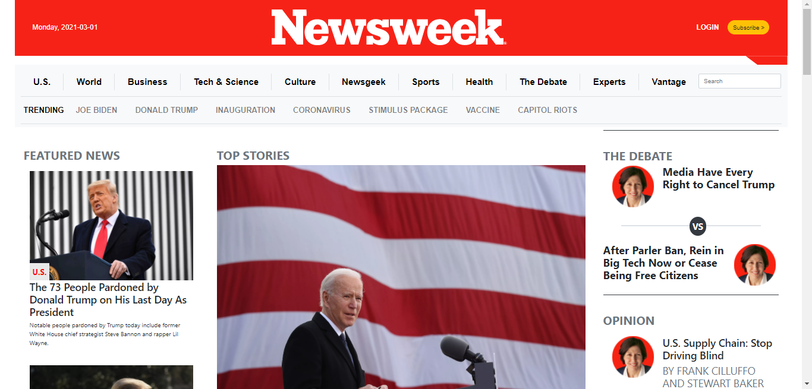

# Newsweek Copy

> For this project we are using Bootstrap 4.3.1 to make a clone of Newsweek.com website. This clone website is fully responsive.

There is not many feaures, appart from Microverse's linters.

## Built With

- HTML, CSS & Bootstrap 4.3.1

## Live Demo

[Live Demo Link](https://zilton7.github.io/newsweek-copy/)

## Getting Started

**This is an example of how you may give instructions on setting up your project locally.**
**Modify this file to match your project, remove sections that don't apply. For example: delete the testing section if the currect project doesn't require testing.**

To get a local copy up and running follow these simple example steps.

## Authors

👤 **Zil Norvilis**

- GitHub: [@zilton7](https://github.com/zilton7)
- Twitter: [@devnor7](https://twitter.com/devnor7)
- LinkedIn: [zil-norvilis](https://www.linkedin.com/in/zil-norvilis)

👤 **Obetta Francis**

- GitHub: [@chasscepts](https://github.com/chasscepts)
- Twitter: [@ofChass](https://twitter.com/ofChass)
- LinkedIn: [LinkedIn](https://www.linkedin.com/in/francis-obetta-4033b71bb/)

## 🤝 Contributing

Contributions, issues, and feature requests are welcome!

Feel free to check the [issues page](issues/).

## Show your support

Give a ⭐️ if you like this project!

## Acknowledgments

- Hat tip to anyone whose code was used
- Inspiration
- etc

## 📝 License

This project is [MIT](lic.url) licensed.
